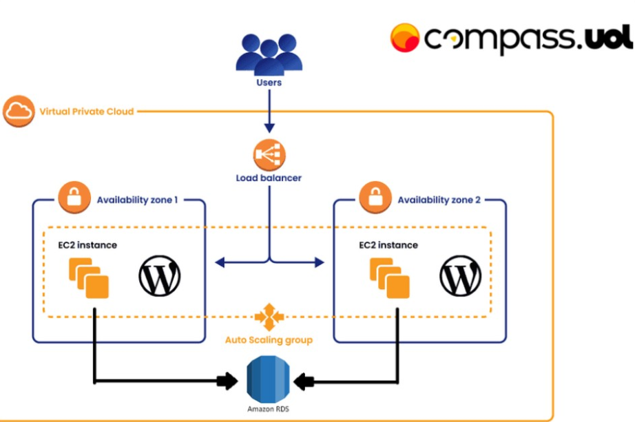

# Atividade-AWS-Docker
## Atividade AWS+Docker Compass UOL.



### Requisitos:

* Efetuar Deploy de uma aplicação Wordpress com container de aplicação RDS database Mysql;
* Configuração do serviço de Load Balancer e Autoscaling AWS para a aplicação Wordpress;
* Configuração da utilização do serviço EFS AWS para estáticos do container de aplicação Wordpress;
* Instalação e configuração do DOCKER ou CONTAINERD no host EC2;

### Arquitetura

* VPC privada: Todas as instâncias EC2 são executadas em sub-redes privadas para maior segurança.
* Elastic Load Balancer (ELB): Roteia o tráfego de entrada para as instâncias EC2. 
* Amazon RDS: Fornece um banco de dados relacional gerenciado.
* Amazon EFS: Sistema de arquivos que permite o compartilhamento entre várias instâncias EC2.
* Auto Scaling Group: Ajusta automaticamente o número de instâncias em resposta à demanda.

Fluxo de Dados:

* O tráfego chega pelo Load Balancer.
* O Load Balancer direciona o tráfego para uma das instâncias EC2 privadas.
* As instâncias EC2 acessam o banco de dados RDS e utilizam o EFS para compartilhar arquivos.

# Configuração

### VPC

Criar a VPC:

* No Console AWS, vá para VPC > Your VPCs > Create VPC.
* Nomeie a VPC, por exemplo, wordpress-vpc.
* Defina um bloco de CIDR para a VPC, como 10.0.0.0/16 (pode ajustar conforme sua necessidade).
* Criar Sub-redes:

* Crie duas sub-redes públicas e duas privadas, uma para cada zona de disponibilidade.
  * Exemplo:
    * Sub-rede 1 (AZ 1): 10.0.1.0/24
    * Sub-rede 2 (AZ 2): 10.0.2.0/24
    * Sub-rede 3 (AZ 1): 10.0.3.0/24
    * Sub-rede 4 (AZ 2): 10.0.4.0/24
* Associar Sub-redes com a Tabela de Rotas:

* Após criar as sub-redes, associe-as a uma tabela de rotas que tenha uma rota para o Gateway de Internet.
* Crie a tabela de rotas em Route Tables > Create Route Table.
* Edite a tabela de rotas e adicione uma rota para a internet (0.0.0.0/0) associada ao Gateway de Internet.
* Criar e Associar Gateway de Internet:

* Vá para Internet Gateways > Create Internet Gateway.
* Após criar, vá para a VPC e associe o Internet Gateway à VPC.
* Associe as redes privadas á um NAT gateway.

### Criar o RDS (Banco de dados)

Criar o RDS:

* No Console AWS, vá para RDS > Databases > Create Database.
* Escolha MySQL ou outro banco de dados compatível com o WordPress.
* Na seção de Template, escolha Dev/Test, Production ou Free tier dependendo do seu caso de uso.

Configurações do RDS:

* DB instance class: Escolha uma instância que atenda às suas necessidades (ex: db.t3.micro).
* Defina as credenciais de login do banco de dados (usuário e senha).
* Escolha uma VPC (a mesma criada no passo anterior).
* Coloque o RDS em Sub-redes Privadas para maior segurança (caso deseje evitar exposição direta).

Configurar o Security Group (SG):

* Crie um Security Group que permita tráfego MySQL (porta 3306) proveniente das instâncias EC2.
* No grupo de segurança, adicione uma regra de entrada com a porta 3306, onde o tráfego é permitido apenas a partir do grupo de segurança que será usado nas instâncias EC2.

Anotar o Endpoint:

* Após a criação do banco, anote o Endpoint do banco de dados. Isso será usado na configuração do Docker Compose para conectar o WordPress ao banco de dados.


### Criar o EFS (Elastic File System)

Criar o Amazon EFS:

* No Console AWS, vá para EFS > Create File System.
* Selecione a VPC criada anteriormente.
* Defina as zonas de disponibilidade em que o EFS será acessível (marque ambas as sub-redes públicas criadas anteriormente).

Configurar Security Groups:

* Certifique-se de que o Security Group permite acesso à porta 2049 (NFS), de modo que as instâncias EC2 possam montar o EFS.

### Criar o Auto Scaling e Load Balancer

Configurar o Auto Scaling e Load Balancer :

* Vá para EC2 > Load Balancers > Create Load Balancer.
* Escolha um Application Load Balancer.
* Coloque o load balancer em ambas as sub-redes públicas.
* Defina o Security Group permitindo o tráfego HTTP.

Criar o Auto Scaling Group:

* Vá para EC2 > Auto Scaling Groups > Create Auto Scaling Group.
* Configure as instâncias para escalar em ambas as zonas de disponibilidade.

Configurar Políticas de Escalabilidade:

* Defina políticas de escalabilidade para que o sistema adicione ou remova instâncias com base em métricas como CPU ou tráfego.
* No Lanuch Template, em Advanced Details adicione o seguinte script User data:

* userdata.sh
```
#!/bin/bash

yum update -y

amazon-linux-extras install docker -y
service docker start
usermod -a -G docker ec2-user

curl -L "https://github.com/docker/compose/releases/download/v2.2.3/docker-compose-$(uname -s)-$(uname -m)" -o /usr/local/bin/docker-compose
chmod +x /usr/local/bin/docker-compose

systemctl enable docker

yum install -y nfs-utils amazon-efs-utils

mkdir /mnt/efs
mount -t efs <Seu_File_System_Id> /mnt/efs
echo '<Seu_File_System_Id>:/ /mnt/efs efs defaults,_netdev 0 0' >> /etc/fstab

mkdir -p /mnt/efs/wordpress
chown -R ec2-user:ec2-user /mnt/efs/wordpress
chmod -R 775 /mnt/efs/wordpress

cat <<EOF > /home/ec2-user/docker-compose.yml
version: '3.8'

services:
  wordpress:
    image: wordpress:latest
    restart: always
    ports:
      - "80:80"
    environment:
      WORDPRESS_DB_HOST: <Seu_Endpoint_RDS>
      WORDPRESS_DB_USER: <Seu_User_RDS>
      WORDPRESS_DB_PASSWORD: <Sua_senha_RDS>
      WORDPRESS_DB_NAME: <Seu_Database_Name_RDS>
    volumes:
      - /mnt/efs/wordpress:/var/www/html
EOF

chown ec2-user:ec2-user /home/ec2-user/docker-compose.yml

cd /home/ec2-user
docker-compose up -d
```
* Associe o Launch Template ou Launch Configuration que usa a AMI das instâncias que você configurou.

O Script vai:

  * Instalar o docker e docker-compose e dar as permissões necessárias.
  * Instalar os pacotes necessários para a montagem do EFS, criar um diretório, montar o EFS e dar as permissões necessárias.
  * Criar um arquivo docker-compose com a imagem do wordpress, mapeamento de porta e ambiente de configuração para a conexão com o banco de dados.
  * Dar as permissões necessárias ao arquivo.
  * Subir o docker-compose.

### Conectar Tudo e Testar

* Configurar DNS e Domínio (opcional):
* Se você tiver um domínio, aponte o tráfego para o Load Balancer.

### Testar a Aplicação:

* Acesse o Load Balancer via navegador para garantir que o WordPress está funcionando corretamente.
* Verifique a conectividade com o RDS e o compartilhamento de arquivos via EFS.


